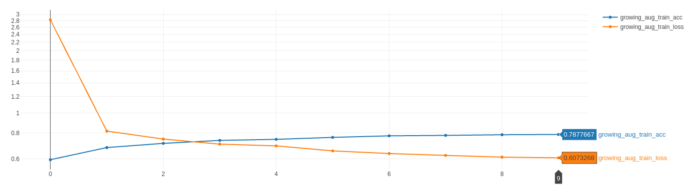
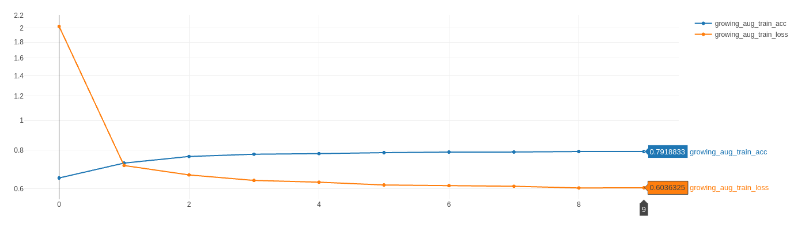
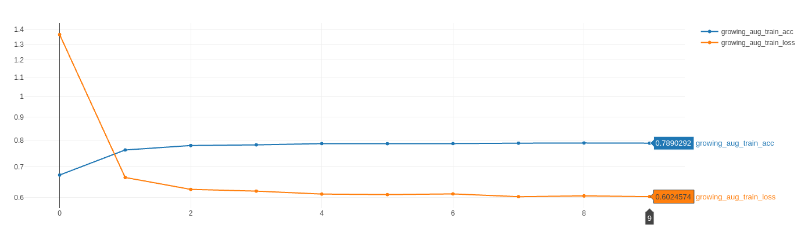
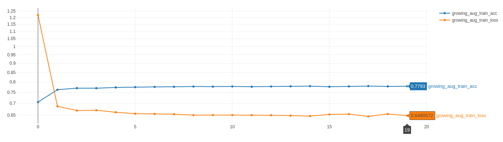
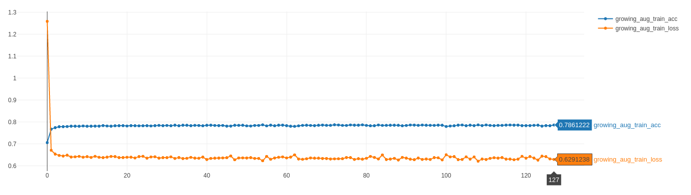
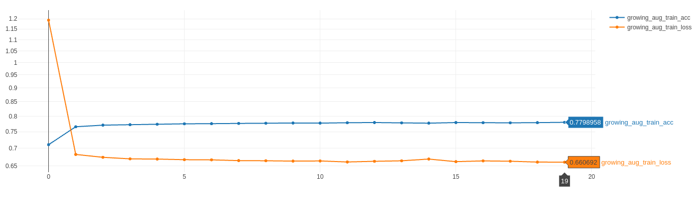

# Fashion-MNIST 
## Обучение 
```bash
python -m runners train --epochs 10
Epoch 1/10
1875/1875 [==============================] - 2s 1ms/step - loss: 2.6009 - accuracy: 0.6736 
Epoch 2/10
1875/1875 [==============================] - 2s 1ms/step - loss: 0.7870 - accuracy: 0.7058
Epoch 3/10
1875/1875 [==============================] - 2s 1ms/step - loss: 0.6562 - accuracy: 0.7489
Epoch 4/10
1875/1875 [==============================] - 3s 2ms/step - loss: 0.6084 - accuracy: 0.7771
Epoch 5/10
1875/1875 [==============================] - 3s 1ms/step - loss: 0.5751 - accuracy: 0.7896
Epoch 6/10
1875/1875 [==============================] - 2s 1ms/step - loss: 0.5591 - accuracy: 0.7973
Epoch 7/10
1875/1875 [==============================] - 3s 1ms/step - loss: 0.5532 - accuracy: 0.8011
Epoch 8/10
1875/1875 [==============================] - 3s 2ms/step - loss: 0.5393 - accuracy: 0.8046
Epoch 9/10
1875/1875 [==============================] - 3s 2ms/step - loss: 0.5350 - accuracy: 0.8101
Epoch 10/10
1875/1875 [==============================] - 2s 1ms/step - loss: 0.5337 - accuracy: 0.8130
```
Также можно указать дополнительный параметр `--model_path` и дообучить
модель еще на нескоьких эпохах

## Тестирование
```bash
python -m runners test --model_path  saved_models/fashion_mnist_train_2021_6_16_19_54_33
313/313 [==============================] - 0s 726us/step - loss: 0.5992 - accuracy: 0.8249
```

## Аугментация
_Ниже будет рассмотрено обучение сети на аугментированных данных
методом_ `growing batch`


Параметр `n` обозначает коэффициент множественности
аугментации данных

Параметр `k` означает количество различных аугментаций,
которые могут применяться к элементу выборки в 
единственном количестве

Размер `batch_size` во всех запуска равен 32

Количество изображений в датасете `fashion_mnist` равно 60 000

Для того, чтобы посчитать количество изображений в
аугментированном датасете необходимо `n` * 60 000

### Эксперименты

Рассмотрим сходимость обучения и тестовые метрики
при небольшом `n`, `epochs` соответственно тоже 
возьмем небольшим т.к. согласно статье [[Drawing Multiple Augmentation Samples Per Image
During Training Efficiently Decreases Test Error]](https://arxiv.org/pdf/2105.13343.pdf) обучение
сходится медленнее, если `n` велико, значит для малых `n` вполне
хватит 10 эпох обучения на аугментированных данных

+ `n` = 1
+ `epochs` = 10
+ `k` = 4



test_acc  | test_loss 
:--------:|:-----:
0.806     | 0.591 

* * *
+ `n` = 2
+ `epochs` = 10
+ `k` = 4



test_acc  | test_loss 
:--------:|:-----:
0.822     | 0.566 

* * *

+ `n` = 4
+ `epochs` = 10
+ `k` = 4




test_acc  | test_loss 
:--------:|:-----:
0.823  (Best)   | 0.586

* * *

Итак, в примере выше был получен экспериментальный
максимум для тестовой метрики. Теперь возьмем большие
`n` и соответственно большее число `epochs` для дальнейшего
исследования сходимости обучения и тестовой метрики

+ `n` = 6
+ `epochs` = 20
+ `k` = 7



test_acc  | test_loss 
:--------:|:-----:
0.806     | 0.701

* * *

+ `n` = 6
+ `epochs` = 128
+ `k` = 7



test_acc  | test_loss 
:--------:|:-----:
0.811     | 1.429

* * *

+ `n` = 8
+ `epochs` = 20
+ `k` = 7



test_acc  | test_loss 
:--------:|:-----:
0.799     | 0.663

* * *

## Резюме

Эксперементальный максимум тестовой метрики `test_accuracy` = 0.823 был получен при количестве
`epochs` обучения = 10, множестве аугментаций `k` = 4,
множественности аугментации данных `n` = 4.

Дальнейшие увеличение параметров `n` и `k` показали
снижение тестовых метрик и очень незначительный прирост
тренировочной точности `growing_batch_train_acc` в процессе
обучения

При тренировке сети на датасете из 60 000 записей без аугментации
мы имеем тестовую метрику точности `test_acc` = 0.824. При тренировке
сети на аугментированном датасете из 4 * 60 000 = 240 000 записей
имеем экспериментальный максимум тестовой метрики точности 
`growing_batch_train_acc` = 0.823. 

Таким образом, при множественной аугментации датасета `fashion_mnist`
с коэффициентом множественности `n` = 4
были получены те же тестовые метрики, что и при обучении
на датасете без аугментации. Преимуществ аугментированного подхода
в рамках данного учебного эксперимента выявлено не было


