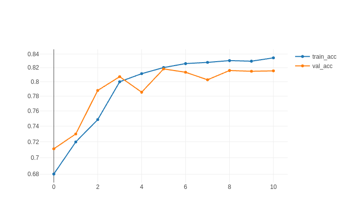
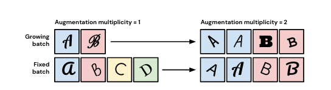
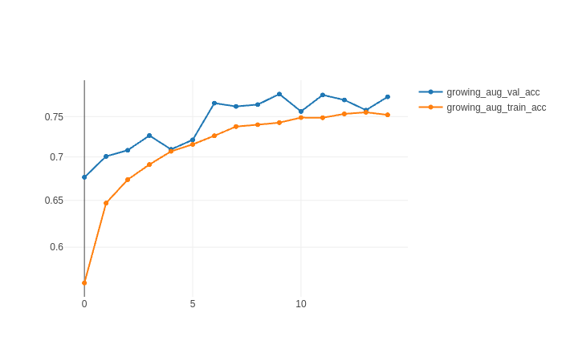
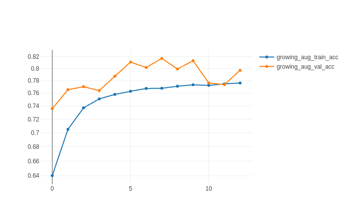
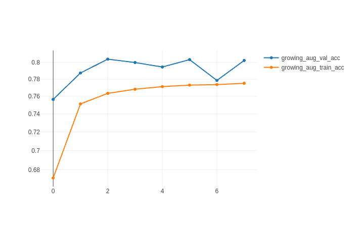
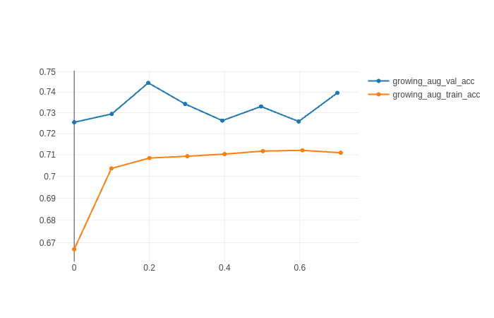
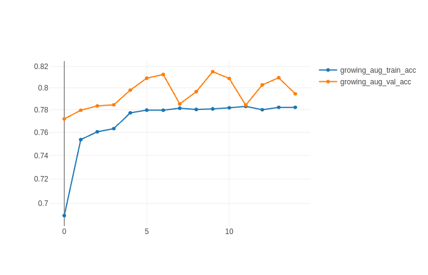
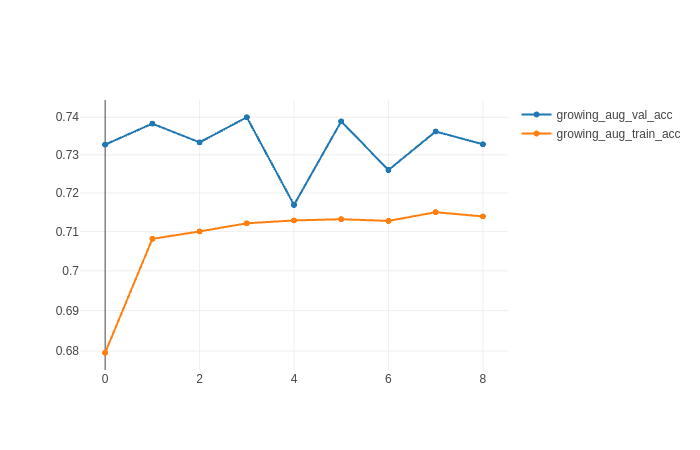

# Fashion-MNIST 
## Обучение 
```bash
python -m runners train --epochs 10
Epoch 1/1024
1875/1875 [==============================] - 3s 1ms/step - loss: 3.5684 - accuracy: 0.6803 - val_loss: 0.8238 - val_accuracy: 0.7111
Epoch 2/1024
1875/1875 [==============================] - 2s 1ms/step - loss: 0.7325 - accuracy: 0.7197 - val_loss: 0.7170 - val_accuracy: 0.7299
Epoch 3/1024
1875/1875 [==============================] - 5s 3ms/step - loss: 0.6510 - accuracy: 0.7486 - val_loss: 0.6093 - val_accuracy: 0.7879
Epoch 4/1024
1875/1875 [==============================] - 2s 1ms/step - loss: 0.5701 - accuracy: 0.8000 - val_loss: 0.5773 - val_accuracy: 0.8072
Epoch 5/1024
1875/1875 [==============================] - 5s 3ms/step - loss: 0.5368 - accuracy: 0.8115 - val_loss: 0.5907 - val_accuracy: 0.7855
Epoch 6/1024
1875/1875 [==============================] - 2s 1ms/step - loss: 0.5145 - accuracy: 0.8202 - val_loss: 0.5625 - val_accuracy: 0.8183
Epoch 7/1024
1875/1875 [==============================] - 2s 1ms/step - loss: 0.5047 - accuracy: 0.8260 - val_loss: 0.5579 - val_accuracy: 0.8135
Epoch 8/1024
1875/1875 [==============================] - 2s 1ms/step - loss: 0.4985 - accuracy: 0.8277 - val_loss: 0.6127 - val_accuracy: 0.8028
Epoch 9/1024
1875/1875 [==============================] - 2s 1ms/step - loss: 0.4929 - accuracy: 0.8303 - val_loss: 0.5858 - val_accuracy: 0.8160
Epoch 10/1024
1875/1875 [==============================] - 2s 1ms/step - loss: 0.4865 - accuracy: 0.8295 - val_loss: 0.5560 - val_accuracy: 0.8149
Epoch 11/1024
1875/1875 [==============================] - 5s 3ms/step - loss: 0.4865 - accuracy: 0.8344 - val_loss: 0.6054 - val_accuracy: 0.8155
```
Также можно указать дополнительный параметр `--model_path` и дообучить
модель еще на нескоьких эпохах

График точности при обучении как показано выше



+ `epochs` (Best Test Accuracy) = 7

Best test_acc  | 
:--------:|
0.818      |

## Тестирование
```bash
python -m runners test --model_path  saved_models/fashion_mnist_train_2021_6_16_19_54_33
313/313 [==============================] - 0s 726us/step - loss: 0.5992 - accuracy: 0.8249
```

## Аугментация
_Ниже будет рассмотрено обучение сети на аугментированных данных
методом_ `growing batch`



Параметр `n` обозначает коэффициент множественности
аугментации данных

Параметр `k` означает количество различных аугментаций,
которые могут применяться к элементу выборки в 
единственном количестве

Размер `batch_size` во всех запуска равен 32

Количество изображений в датасете `fashion_mnist` равно 60 000

Для того, чтобы посчитать количество изображений в
аугментированном датасете необходимо `n` * 60 000

Cогласно статье [[Drawing Multiple Augmentation Samples Per Image
During Training Efficiently Decreases Test Error]](https://arxiv.org/pdf/2105.13343.pdf)
обучение на аугментированных данных дает лучшую тестовую
метрику в сравнении с обучением на обычных данных. С ростом 
параметра `n` требуется меньшее число эпох для того, чтобы
добиться наилучшей тестовой метрики

### Эксперименты

Возьмем `k` = 7

```python
import albumentations as A

self.__augmentations = [
            A.JpegCompression(quality_lower=0, quality_upper=1, p=1),
            A.Rotate(limit=45),
            A.Blur(blur_limit=(3, 3), p=1),
            A.Cutout(num_holes=9, max_h_size=1, max_w_size=1, fill_value=255, p=1),
            A.HorizontalFlip(p=1),
            A.VerticalFlip(p=1),
            A.GaussNoise(p=1)
        ]
```

Обучение будем останавливать преждевременно, если в 
течение 5 эпох тестовая метрика не дает прироста
относительно своего максимального значения

+ `n` = 1
+ `epochs` = 10



Best test_acc  | 
:--------:|
0.78      |

* * *
+ `n` = 2
+ `epochs` = 8




Best test_acc  | 
:--------:|
0.817     |
* * *

+ `n` = 4
+ `epochs` = 3




Best test_acc  | 
:--------:|
0.804     |

* * *

+ `n` = 6
+ `epochs` = 3



Best test_acc  |
:--------:|
0.744    |

* * *

+ `n` = 8
+ `epochs` = 9




Best test_acc  |
:--------:|
0.815    |

* * *

+ `n` = 10
+ `epochs` = 4




Best test_acc  |
:--------:|
0.74    |

* * *

## Резюме

Эксперементальный максимум тестовой метрики `test_accuracy` = 0.818 был получен при количестве
`epochs` обучения = 7 на датасете без аугментаций и практически равняется максимуму
тестовой метрики при обучении с использованием аугментации `growing_batch_train_acc` = 0.815 
при `n` = 8 и `epochs` = 9. 

Также была замечена наилучшая сходимость тестовой метрики при `k` ~ `n`

Таким образом, при множественной аугментации датасета `fashion_mnist`
с коэффициентом множественности `n` = 8
были получены те же тестовые метрики, что и при обучении
на датасете без аугментации. Сеть обучилась за большое число эпох, на количестве данных (8 * 60 000 -> 480 000)


